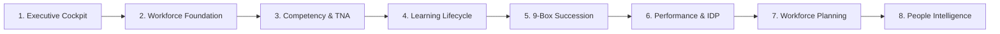

# 📘 BUKU PANDUAN PENGGUNA & INSTALASI LENGKAP
## WorkforceOS — Enterprise Talent & Training Management System

---

## 📑 DAFTAR ISI
1. [Pengenalan Aplikasi & Arsitektur](#1-pengenalan-aplikasi--arsitektur)
2. [Persyaratan Sistem & Spesifikasi](#2-persyaratan-sistem--spesifikasi)
3. [Panduan Instalasi & Menjalankan Aplikasi](#3-panduan-instalasi--menjalankan-aplikasi)
4. [Panduan Lisensi & Sistem Akses Akun](#4-panduan-lisensi--sistem-akses-akun)
5. [Pengaturan Profil Perusahaan & Kustomisasi Logo](#5-pengaturan-profil-perusahaan--kustomisasi-logo)
6. [Panduan Penggunaan 8 Grand Strategic Modules](#6-panduan-penggunaan-8-grand-strategic-modules)
   - [Modul 1: Executive Strategic Cockpit](#modul-1-executive-strategic-cockpit)
   - [Modul 2: Workforce Foundation & Movement](#modul-2-workforce-foundation--movement)
   - [Modul 3: Competency Framework & TNA Engine](#modul-3-competency-framework--tna-engine)
   - [Modul 4: Learning & Annual Training Lifecycle](#modul-4-learning--annual-training-lifecycle)
   - [Modul 5: 9-Box Talent & Succession Bench](#modul-5-9-box-talent--succession-bench)
   - [Modul 6: Performance & Individual Development Plan (IDP)](#modul-6-performance--individual-development-plan-idp)
   - [Modul 7: Manpower Planning (MPP) & 4-Pillar Studio](#modul-7-manpower-planning-mpp--4-pillar-studio)
   - [Modul 8: People Intelligence & AI Strategic Advisor](#modul-8-people-intelligence--ai-strategic-advisor)
7. [Pencadangan Data, Pemulihan & Ekspor Laporan](#7-pencadangan-data-pemulihan--ekspor-laporan)
8. [Tanya Jawab & Troubleshooting (FAQ)](#8-tanya-jawab--troubleshooting-faq)
9. [Layanan Bantuan & Dukungan Teknis](#9-layanan-bantuan--dukungan-teknis)

---

## 1. Pengenalan Aplikasi & Arsitektur

**WorkforceOS** adalah sistem operasi manajemen talenta, kompetensi, dan pelatihan terpadu (*Human Capital Operating System*) kelas korporat yang dirancang khusus untuk sektor industri dengan regulasi ketat dan skala operasional besar (Pertambangan Minerba, Manufaktur, Energi, Logistik, dan Perkebunan).

### Keunggulan Utama WorkforceOS:
- **100% Offline-First & Privasi Data Terjamin**: Seluruh 17 basis data operasional disimpan di komputer/server lokal perusahaan tanpa risiko kebocoran data pihak ketiga.
- **Performa Instan Tanpa Latensi**: Tidak bergantung pada koneksi internet untuk navigasi, pencarian data, perhitungan TNA, maupun visualisasi 9-Box.
- **Dual Deployment**: Dapat dijalankan sebagai aplikasi desktop standalone (*Tauri/Executable*) maupun server jaringan lokal (*Web On-Premise LAN*).
- **Asisten AI Terintegrasi**: Dilengkapi mesin AI pintar berbasis Google Gemini untuk analisis prediktif risiko retensi karyawan dan penyusunan executive summary.

---

## 2. Persyaratan Sistem & Spesifikasi

### Rekomendasi Perangkat Keras (Hardware):
| Komponen | Spesifikasi Minimum | Spesifikasi Direkomendasikan |
| :--- | :--- | :--- |
| **Prosesor (CPU)** | Intel Core i3 / AMD Ryzen 3 (Dual Core 2.0 GHz) | Intel Core i5 / AMD Ryzen 5 ke atas |
| **Memori (RAM)** | 4 GB RAM | 8 GB RAM atau lebih |
| **Ruang Penyimpanan** | 500 MB ruang kosong (SSD) | 2 GB ruang kosong (SSD) |
| **Resolusi Layar** | 1366 x 768 piksel | 1920 x 1080 piksel (Full HD) |

### Sistem Operasi yang Didukung:
- **Windows**: Windows 10 / Windows 11 (64-bit).
- **macOS**: macOS 11.0 (Big Sur) atau versi lebih baru.
- **Linux**: Ubuntu 20.04+, Debian 10+, Fedora 34+.
- **Web Browser (Jika mode web)**: Google Chrome, Microsoft Edge, Mozilla Firefox, Opera, atau Safari versi terbaru.

---

## 3. Panduan Instalasi & Menjalankan Aplikasi

WorkforceOS menyediakan beberapa metode pengoperasian yang sangat fleksibel:

### 🟢 Metode 1: Menjalankan via Skrip Pintasan (Termudah untuk Windows)
1. Ekstrak folder aplikasi WorkforceOS ke direktori yang Anda inginkan (misal: `D:\APLIKASI_WORKFORCEOS`).
2. Klik ganda pada file **`JALANKAN_APLIKASI.bat`**.
3. Aplikasi akan otomatis menyiapkan server lokal dan membuka browser secara instan pada alamat `http://localhost:5173`.

### 🟢 Metode 2: Menjalankan Mode Web / Server On-Premise (Node.js)
Gunakan metode ini jika Anda ingin meng-host aplikasi di server lokal kantor agar bisa diakses oleh banyak komputer di jaringan LAN yang sama:
1. Pastikan **Node.js** (versi 18 ke atas) sudah terinstal di komputer.
2. Buka aplikasi Terminal atau Command Prompt di folder aplikasi.
3. Jalankan perintah instalasi dependensi (hanya dilakukan sekali di awal):
   ```bash
   npm install
   ```
4. Jalankan aplikasi:
   ```bash
   npm run dev
   ```
5. Buka alamat yang muncul di terminal (contoh: `http://localhost:5173` atau `http://192.168.1.100:5173`).

---

## 4. Panduan Lisensi & Sistem Akses Akun

Halaman masuk (*Login Page*) WorkforceOS dirancang dengan antarmuka modern yang membagi akses ke dalam 2 pilihan utama:

```
+-------------------------------------------------------------+
|                      WorkforceOS                            |
|                                                             |
|   [ 🔑 Sudah Punya Lisensi ]    [ ⚡ Demo Aplikasi ]        |
+-------------------------------------------------------------+
```

### 1. Komparasi Mode Demo vs Lisensi Komersial Enterprise:

| Fitur & Kemampuan | Mode Demo (Evaluasi) | Lisensi Komersial Enterprise |
| :--- | :---: | :---: |
| **Kapasitas Karyawan per Tabel** | Maksimal 5 Data | **Tanpa Batas (Unlimited Headcount)** |
| **Modifikasi & Pembuatan Data** | Dibatasi Kuota Demo | **Penuh (Full Read & Write)** |
| **Modul Analitikal (9-Box & TNA)** | Read-Only (Peringatan Mode Demo) | **Interaktif Penuh (Bebas Edit & Analisis)** |
| **Ekspor Dokumen PDF & Excel** | Terbatas | **Resolusi Tinggi & Batch Export** |
| **Penyimpanan Database Persisten** | Sementara | **SQLite Persisten & Backup JSON Lengkap** |
| **Legalitas Penggunaan Komersial** | Hanya Uji Coba Internal | **Lisensi Resmi Korporat Seumur Hidup** |

---

### 2. Cara Masuk Menggunakan Lisensi Resmi:
1. Pada halaman login, klik tombol biru **"Sudah Punya Lisensi"**.
2. Masukkan 5 data identitas resmi:
   - **Perusahaan / Organisasi**: Nama lengkap entitas korporasi Anda (misal: `PT Aman Kerja`).
   - **Nama Lengkap PIC**: Nama pengguna pengelola sistem (misal: `Ahmad Faqih Didin`).
   - **Email Resmi**: Alamat email korporat pengelola (misal: `corporate@amankerja.co.id`).
   - **Nomor HP / WhatsApp**: Nomor kontak aktif PIC (misal: `+62 812-3456-7890`).
   - **Kunci Serial Lisensi**: Serial lisensi resmi korporat Anda (contoh bawaan: `WOS-ENT-2026-AK-9988-MINING`).
3. Klik tombol **"Masuk ke WorkforceOS"**.
4. Seluruh fitur akan terbuka penuh tanpa batas kuota data.

---

### 3. Cara Upgrade / Aktivasi Lisensi dari Mode Demo:
Jika Anda sebelumnya masuk menggunakan **Demo Aplikasi** dan ingin beralih ke Lisensi Penuh tanpa kehilangan data:
1. Klik tombol **"Aktivasi Lisensi Penuh"** pada Banner Kuning di bagian atas layar ATAU buka menu **Pengaturan (`⚙️`) > Tab Lisensi & Produk**.
2. Masukkan data identitas perusahaan, nama PIC, email, no HP, dan Kunci Serial Lisensi resmi Anda.
3. Klik **"Aktivasi & Simpan Lisensi Enterprise"**.
4. Status akun akan seketika berubah menjadi **Commercial Ready**, banner Read-Only akan hilang, dan kapasitas data otomatis menjadi tak terbatas.

---

## 5. Pengaturan Profil Perusahaan & Kustomisasi Logo

WorkforceOS memungkinkan perusahaan menyesuaikan identitas visual secara menyeluruh:

### Cara Mengunggah & Mengganti Logo:
1. Klik logo di pojok kiri atas Sidebar ATAU buka menu **Pengaturan (`⚙️`) > Tab Profil Perusahaan**.
2. Pada bagian **Logo Perusahaan / Branding Organisasi**, klik tombol **"Pilih File"**.
3. Pilih file gambar logo perusahaan Anda (mendukung format `PNG`, `SVG`, `JPG`, `WebP` hingga 2MB).
4. Logo akan langsung tersimpan dan otomatis menggantikan:
   - Logo di **Sidebar Navigasi** (saat terbuka maupun saat diciutkan).
   - Ikon tab browser (**Favicon**).
   - Logo pada **Halaman Login**.
   - Header dokumen formal pada ekspor **Laporan PDF & Excel**.
5. *Jika ingin menghapus logo dan kembali ke ikon standar, cukup klik tombol silang merah (❌) pada kotak pratinjau logo.*

---

## 6. Panduan Penggunaan 8 Grand Strategic Modules



---

### Modul 1: Executive Strategic Cockpit
**Fungsi**: Pusat kendali eksekutif untuk melihat kesehatan seluruh human capital korporasi secara *real-time*.
- **Metrik Utama**: Total headcount aktif, *Competency Compliance Rate* (% pemenuhan kompetensi), realisasi anggaran pelatihan, dan *Bench Strength Ratio* (kesiapan suksesi kepemimpinan).
- **Skill Gap Distribution**: Grafik perbandingan keahlian standar vs riil antar departemen.
- **Budget Burn Rate Tracker**: Pemantauan serapan biaya training per kuartal vs target tahunan.

---

### Modul 2: Workforce Foundation & Movement
**Fungsi**: Pengelolaan data induk karyawan, struktur organisasi, dan mutasi internal.
- **17 Master Domain Tables**: Mencakup data master Karyawan, Posisi, Departemen, Grade Jabatan, Rekam Mutasi, Promosi, Demosi, hingga Terminasi.
- **Employee 360° Profile**: Klik nama karyawan untuk membuka profil 360 derajat lengkap yang berisi data personal, radar kompetensi, riwayat sertifikasi aktif, catatan KPI, dan status suksesi.
- **Bagan Organisasi Hierarkis**: Visualisasi struktur komando interaktif dari level Direksi hingga Staff lapangan.

---

### Modul 3: Competency Framework & TNA Engine
**Fungsi**: Standarisasi kompetensi kerja dan analisis kebutuhan pelatihan otomatis.
- **Kamus Kompetensi**: Pengelompokan kompetensi inti (*Core*), kepemimpinan (*Leadership*), teknis (*Technical/Functional*), dan K3 Keselamatan Kerja.
- **Matriks Pelatihan per Jabatan**: Menentukan modul wajib & standar nilai kelulusan per grade.
- **Automated TNA (Training Needs Analysis)**: Sistem otomatis membandingkan nilai uji kompetensi karyawan dengan standar jabatan. Jika terdapat nilai di bawah standar, modul pelatihan yang relevan akan langsung direkomendasikan.
- **Skill Gap Heatmap**: Peta panas visual untuk mendeteksi kesenjangan keahlian di seluruh departemen.

---

### Modul 4: Learning & Annual Training Lifecycle
**Fungsi**: Manajemen siklus pelatihan tahunan dan kepatuhan sertifikasi legalitas K3.
- **Annual Training Calendar**: Kalender pelatihan tahunan interaktif yang menampilkan jadwal kelas, instruktur, lokasi, dan status pelaksanaan.
- **Certification & License Expiry Tracker**: Sistem peringatan otomatis untuk sertifikasi K3 (misal: POP, POM, K3 Umum, Lisensi Alat Berat) yang akan kedaluwarsa dalam 30, 60, atau 90 hari.
- **Ekspor iCalendar (.ics)**: Tombol sekali klik untuk menyinkronkan seluruh jadwal pelatihan ke kalender Outlook, Google Calendar, atau Apple Calendar PIC dan trainer.

---

### Modul 5: 9-Box Talent & Succession Bench
**Fungsi**: Pemetaan talenta strategis dan jalur suksesi posisi kunci perusahaan.
- **Matriks 9-Box (Performance vs Potential)**: Mengelompokkan seluruh karyawan ke dalam 9 kuadran talenta (*Star, High Potential, High Professional, Core Player, Dilemma, Risk,* dll).
- **Succession Pipeline**: Menentukan calon suksesor untuk setiap posisi kritis dengan 3 kategori kesiapan:
  - 🟢 **Ready Now** (Siap promosi seketika).
  - 🟡 **Ready in 1-2 Years** (Membutuhkan pembinaan jangka menengah).
  - 🟠 **Ready in 3+ Years** (Talenta potensial jangka panjang).
- **Emergency Successor Alert**: Menyoroti posisi kunci yang belum memiliki suksesor siap pakai untuk mencegah risiko kekosongan kepemimpinan.

---

### Modul 6: Performance & Individual Development Plan (IDP)
**Fungsi**: Pengelolaan evaluasi kinerja berkala dan rencana pengembangan personal.
- **KPI Management**: Penilaian capaian target kerja per semester/tahunan.
- **Framework Pengembangan 70-20-10**:
  - **70% Experiential Learning**: Penugasan proyek strategis, magang jabatan, dan *on-the-job training*.
  - **20% Social Learning**: Mentoring dari atasan, *coaching*, dan observasi kerja.
  - **10% Formal Learning**: Pelatihan kelas formal dan sertifikasi profesi.

---

### Modul 7: Manpower Planning (MPP) & 4-Pillar Studio
**Fungsi**: Perencanaan kebutuhan tenaga kerja jangka panjang berbasis analisis beban kerja.
- **Workload Analysis & FTE Calculator**: Menghitung kebutuhan jumlah orang ideal (*Full-Time Equivalent*) berdasarkan volume kerja riil di lapangan.
- **Turnover vs Recruitment Projection**: Simulasi kebutuhan rekrutmen baru terhadap prediksi karyawan pensiun atau mengundurkan diri.
- **Studio 4-Pilar**: Skenario optimalisasi tenaga kerja melalui strategi *Retain, Reskill, Recruit,* dan *Redeploy*.

---

### Modul 8: People Intelligence & AI Strategic Advisor
**Fungsi**: Pusat intelijen talenta berbantuan Google Gemini AI.
- **AI Retention Risk Analysis**: Memprediksi potensi risiko hilangnya talenta terbaik berdasarkan kepuasan, kompensasi, dan tren performa.
- **Smart Training Recommender**: Rekomendasi modul pelatihan paling efisien berdasarkan analisis gap kompetensi massal.
- **Executive Summary Generator**: Pembuatan ringkasan eksekutif instan satu lembar untuk laporan bulanan Direksi.

---

## 7. Pencadangan Data, Pemulihan & Ekspor Laporan

### 1. Pencadangan Lengkap (Backup Full Database):
1. Buka menu **Pengaturan (`⚙️`) > Tab Backup & Restore**.
2. Klik tombol biru **"Unduh Cadangan Lengkap"**.
3. Sistem akan menghasilkan file snapshot `.JSON` berisi seluruh 17 domain data (Karyawan, TNA, 9-Box, Suksesi, Kalender, MPP, IDP, dan Pengaturan).
4. Simpan file ini di tempat yang aman (Google Drive, flashdisk, atau server backup).

### 2. Pemulihan Data (Restore Database):
1. Buka menu **Pengaturan (`⚙️`) > Tab Backup & Restore**.
2. Klik tombol ungu **"Pilih File Backup (.JSON)"**.
3. Pilih file cadangan yang sebelumnya diunduh.
4. Seluruh data dan relasi akan dipulihkan seketika.

### 3. Ekspor Laporan Formal (PDF & Excel):
- **Ekspor Excel (.xlsx)**: Klik ikon Spreadsheet di header tabel mana pun untuk mengunduh seluruh data dalam format tabel Excel yang rapi dan siap diolah.
- **Cetak Laporan PDF**: Klik ikon PDF atau Cetak untuk membuat dokumen formal lengkap dengan kop surat perusahaan, logo, tanggal ekspor, dan tanda tangan legalitas.

---

## 8. Tanya Jawab & Troubleshooting (FAQ)

#### Q1: Apakah aplikasi ini membutuhkan koneksi internet untuk beroperasi sehari-hari?
> **A**: Tidak. WorkforceOS bekerja 100% secara offline pada komputer Anda. Internet hanya diperlukan jika Anda ingin menggunakan fitur asisten online Google Gemini AI.

#### Q2: Apa yang terjadi jika komputer saya rusak atau saya berganti laptop?
> **A**: Sangat mudah! Anda cukup mengunduh file Backup JSON dari laptop lama melalui menu Pengaturan > Backup, lalu lakukan Restore pada laptop baru. Semua data akan kembali utuh.

#### Q3: Bagaimana jika port 5173 sudah digunakan aplikasi lain?
> **A**: Sistem Vite akan otomatis mencari port berikutnya yang tersedia (misal: `http://localhost:5174`). Anda cukup membuka tautan port yang tertera di layar terminal.

#### Q4: Bagaimana cara mengganti Kunci Serial Lisensi jika perusahaan memperbarui paket lisensi?
> **A**: Buka menu **Pengaturan (`⚙️`) > Tab Lisensi & Produk**, masukkan serial lisensi baru, lalu klik **"Aktivasi & Simpan Lisensi Enterprise"**.

---

## 9. Layanan Bantuan & Dukungan Teknis Resmi

Untuk pertanyaan teknis, aktivasi lisensi tambahan, perpanjangan masa berlaku, maupun konsultasi implementasi sistem:

- 📱 **WhatsApp Admin**: [+62 822-2308-9790](https://wa.me/6282223089790)
- ✉️ **Email Resmi**: [satriamudaprima@gmail.com](mailto:satriamudaprima@gmail.com) / `corporate@amankerja.co.id`
- 🌐 **Website Resmi**: [https://amankerja.com](https://amankerja.com)
- ❓ **Pusat Panduan Dalam Aplikasi**: Klik menu **Panduan & Simulasi** di sidebar kiri atau ikon tanda tanya (`❓`) di header atas aplikasi kapan saja untuk mengakses simulasi alur kerja interaktif dan glosarium HR.

---

<div align="center">
  <sub>Talent & Training Management System — Enterprise Human Capital Operating System. Seluruh hak cipta dilindungi undang-undang. © 2026.</sub>
</div>

