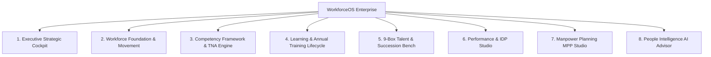

# 🏢 WorkforceOS — Enterprise Talent & Training Management System

<div align="center">


[](https://www.typescriptlang.org/)
[](https://react.dev/)
[](https://vitejs.dev/)
[](https://tailwindcss.com/)
[](https://tauri.app/)
[](https://ai.google.dev/)
[](https://github.com/amankerja/talent-management-and-training-management)

**WorkforceOS** adalah platform sistem operasi manajemen talenta, kompetensi, dan pelatihan korporat terpadu (*Human Capital Operating System*) yang dirancang khusus untuk industri berskala enterprise (Pertambangan, Manufaktur, Energi, Logistik, dan Korporasi Multi-Cabang).

</div>

---

## 🌟 Ringkasan Eksekutif

WorkforceOS menghadirkan pendekatan terintegrasi antara perencanaan tenaga kerja (*Manpower Planning*), pemetaan kompetensi (*Competency Framework & TNA*), pengembangan pelatihan (*Learning & Training Lifecycle*), penilaian performa (*Performance & IDP*), hingga suksesi kepemimpinan (*9-Box Talent Engine*). Dilengkapi dengan asisten kecerdasan buatan (*AI Strategic Advisor*) berbasis Google Gemini serta dukungan dual-deployment (Desktop Offline-First via Tauri & Web On-Premise).

---

## 🏛️ 8 Grand Strategic Modules



### 1. 📊 Executive Strategic Cockpit
- **Real-Time KPIs**: Total headcount aktif, pemenuhan kompetensi korporat (*Competency Compliance Rate*), serapan anggaran pelatihan, serta kesiapan suksesi (*Bench Strength Ratio*).
- **Skill Gap Distribution**: Visualisasi distribusi kesenjangan keahlian antar departemen dan grade jabatan.
- **Budget Burn-Rate Analytics**: Pemantauan realisasi biaya pelatihan tahunan vs anggaran yang dialokasikan.

### 2. 👥 Workforce Foundation & Movement
- **17 Master Domain Tables**: Mengelola data karyawan lengkap, struktur posisi, mutasi/rotasi, promosi, demosi, hingga histori terminasi.
- **Employee 360° Profile**: Tampilan komprehensif riwayat karier, sertifikasi aktif, radar kompetensi, catatan performa, dan rencana suksesi per karyawan.
- **Interactive Organization Hierarchy**: Visualisasi struktur bagan organisasi hierarkis dengan node dinamis.

### 3. 🎯 Competency Framework & TNA Engine
- **Competency Matrix & Heatmap**: Pemetaan standar kompetensi teknis & manajerial per jabatan.
- **Automated Training Needs Analysis (TNA)**: Identifikasi kesenjangan kompetensi individu dan rekomendasi modul pelatihan wajib secara otomatis.
- **Skill Gap Heatmap Matrix**: Matriks visual pemenuhan level kompetensi (Level 1-5) di seluruh divisi kerja.

### 4. 📚 Learning & Annual Training Lifecycle
- **Annual Training Calendar**: Kalender kegiatan pelatihan tahunan interaktif dengan filter departemen, kategori modul, dan status pelaksanaan.
- **Certification & License Expiry Tracker**: Peringatan otomatis menjelang kedaluwarsa sertifikasi profesi atau lisensi K3 karyawan.
- **iCalendar (.ics) Sync & Export**: Sinkronisasi jadwal pelatihan ke Google Calendar, Outlook, dan Apple Calendar.

### 5. 🌟 9-Box Talent & Succession Bench
- **9-Box Performance vs Potential Matrix**: Pengelompokan talenta korporat (Stars, High Potentials, Core Players, Dilemmas, Risk).
- **Critical Position Succession Bench**: Pemetaan calon suksesor untuk posisi kritis korporasi berdasarkan tingkat kesiapan (*Ready Now*, *1–2 Years*, *3+ Years*).
- **Emergency Successor Alert**: Peringatan dini jika terdapat posisi kritis tanpa kandidat penerus yang siap.

### 6. 📈 Performance & Individual Development Plan (IDP)
- **KPI & Target Achievement Tracker**: Pemantauan pencapaian sasaran kerja individu dan tim.
- **70-20-10 Development Framework**: Rencana pengembangan komprehensif (*70% Experiential Learning, 20% Mentoring/Coaching, 10% Formal Training*).
- **Periodic Performance Review Cycles**: Riwayat evaluasi semesteran/tahunan yang terintegrasi ke 9-Box.

### 7. 🏗️ Manpower Planning (MPP) & 4-Pillar Studio
- **Workload Analysis & FTE Calculator**: Perhitungan kebutuhan beban kerja (*Full-Time Equivalent*) berbasis data operasional.
- **Turnover vs Recruitment Modeling**: Proyeksi penambahan dan penggantian headcount per kuartal.
- **4-Pillar Workforce Scenario**: Pemodelan strategi *Retain, Reskill, Recruit,* dan *Redeploy*.

### 8. 🤖 People Intelligence & AI Strategic Advisor
- **Google Gemini 2.5 Integration**: Analisis prediktif terhadap risiko retensi karyawan, analisis kesiapan suksesi, dan saran alokasi anggaran training.
- **Executive Strategic Briefing Generator**: Pembuatan laporan eksekutif instan dan rekomendasi kebijakan HR berbasis data.

---

## 🔐 Sistem Akses & Keamanan Akun

Sistem menyediakan dua mode operasional terpadu:

| Fitur / Modul | Mode Demo (Evaluasi) | Lisensi Enterprise Komersial |
| :--- | :---: | :---: |
| **Kapasitas Data per Tabel** | Maksimal 5 Data | **Tanpa Batas (Unlimited)** |
| **Hak Modifikasi Analitikal** | Read-Only (Peringatan Khusus) | **Full Read & Write** |
| **Penyimpanan Database** | Memory / Local Snapshot | **Persistent SQLite & JSON Backup** |
| **Ekspor PDF & Excel Korporat** | Terbatas | **Full High-Res & Batch Export** |
| **AI Strategic Advisor** | Mode Pratinjau | **Full Prompting & Deep Insights** |
| **Dukungan Multi-Platform** | Web Preview | **Desktop App (Tauri) + Web Server** |

> **Catatan Aktivasi:** Pengguna dapat berpindah dari Mode Demo ke Lisensi Penuh kapan saja melalui menu pengaturan dengan memasukkan identitas lengkap perusahaan, nama PIC, email resmi, nomor WhatsApp, dan Kunci Serial Lisensi Korporat.

---

## 🛠️ Tech Stack & Arsitektur

- **Frontend Core**: React 18, TypeScript, Vite
- **Styling & UI**: TailwindCSS v4, Framer Motion, Lucide Icons
- **State Management**: Zustand with LocalStorage & Custom Store Persistence
- **Desktop Runtime**: Tauri v2 (Rust Backend, ultra-ringan < 15MB)
- **Reporting & Data Engine**:
  - `jsPDF` + `jspdf-autotable` untuk pembuatan dokumen sertifikat & laporan PDF
  - `xlsx` untuk ekspor & impor massal spreadsheet Excel
  - Custom SVG Tree Renderer untuk bagan organisasi hierarkis
- **AI Engine**: `@google/genai` SDK (Google Gemini 2.5 Flash / Pro)

---

## 🚀 Panduan Memulai (Getting Started)

### Prasyarat
- [Node.js](https://nodejs.org/) (versi 18.0 atau lebih tinggi)
- Package Manager: `npm`, `yarn`, `pnpm`, atau `bun`
- *(Opsional untuk build desktop)*: [Rust & Cargo](https://www.rust-lang.org/) untuk build aplikasi desktop via Tauri.

### 1. Clone Repositori
```bash
git clone https://github.com/amankerja/talent-management-and-training-management.git
cd talent-management-and-training-management
```

### 2. Instal Dependensi
```bash
npm install
```

### 3. Konfigurasi Environment (Opsional untuk AI)
Salin file `.env.example` menjadi `.env.local` atau `.env`:
```bash
cp .env.example .env.local
```
Tambahkan Google Gemini API Key Anda:
```env
VITE_GEMINI_API_KEY=your_google_gemini_api_key_here
```

### 4. Jalankan Mode Pengembangan (Web)
```bash
npm run dev
```
Buka browser pada alamat [http://localhost:5173](http://localhost:5173) (atau port yang tertera pada terminal).

### 5. Build untuk Produksi (Web)
```bash
npm run build
```
Hasil build web siap digunakan di folder `/dist`.

### 6. Menjalankan / Membangun Aplikasi Desktop (Tauri)
```bash
# Mode dev desktop
npm run tauri dev

# Build installer desktop (.exe / .msi)
npm run tauri build
```

---

## 📁 Struktur Direktori

```text
├── public/                 # Aset statis & favicon
├── src/
│   ├── components/         # Komponen UI terstruktur per domain
│   │   ├── ai/             # AI Advisor View
│   │   ├── auth/           # Login Page & autentikasi lisensi
│   │   ├── common/         # Header, Sidebar, Toast, Modal umum
│   │   ├── competency/     # Competency Framework & TNA View
│   │   ├── executive/      # Executive Strategic Cockpit
│   │   ├── help/           # Pusat Bantuan & Panduan Alur
│   │   ├── intelligence/   # People Intelligence View
│   │   ├── learning/       # Learning & Training Calendar View
│   │   ├── matrix/         # Matriks Pelatihan & Heatmap
│   │   ├── mpp/            # Manpower Planning View
│   │   ├── org/            # Org Chart & Organisasi
│   │   ├── people/         # Direktori Karyawan & Employee 360
│   │   ├── performance/    # Performance & IDP Studio
│   │   ├── settings/       # Pengaturan Sistem & Lisensi
│   │   ├── talent/         # 9-Box & Succession Bench
│   │   └── workforce/      # Workforce Domain Master
│   ├── context/            # Workforce React Context
│   ├── data/               # Mock data & template seeder
│   ├── services/           # DB schema, seeder & Gemini API integration
│   ├── store/              # Zustand state stores (Auth, Settings, UI, Filter)
│   ├── utils/              # PDF exporter, Excel importer/exporter, Calendar sync
│   ├── types.ts            # TypeScript interface definitions
│   ├── App.tsx             # Root Application Component
│   ├── main.tsx            # Application Entry Point
│   └── index.css           # Global Styles & Tailwind Config
├── src-tauri/              # Rust backend & Tauri desktop config
├── package.json
├── tsconfig.json
├── vite.config.ts
└── README.md
```

---

## 📄 Lisensi & Hak Cipta

Dilisensikan di bawah lisensi komersial korporat. Seluruh hak cipta dilindungi undang-undang.

---

<div align="center">
  <sub>Dibangun dengan dedikasi untuk keunggulan manajemen sumber daya manusia korporat. © 2026 WorkforceOS.</sub>
</div>
